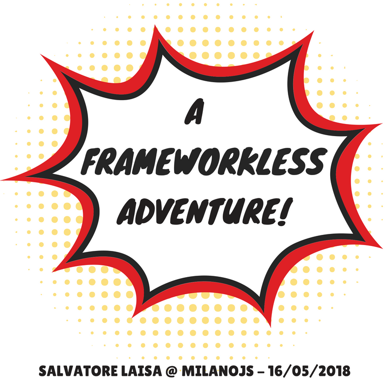

# frameworkless-talk

> Slides and example for the talk "A frameworkless adventure" @ MilanoJS "The Good Party 4th edition" 16-05-2018.

### Install & run
Easy as

* clone the repo
* `yarn` or `npm install` to install the (few) dependencies
* `yarn start` or `npm start` to launch the local server

### Note
This project doesn't use Webpack, Babel, Typescript and so on  **intentionally** to demonstrate the current status of the native Web Platform 😎.

### License
Released undert the [MIT license](LICENSE).
